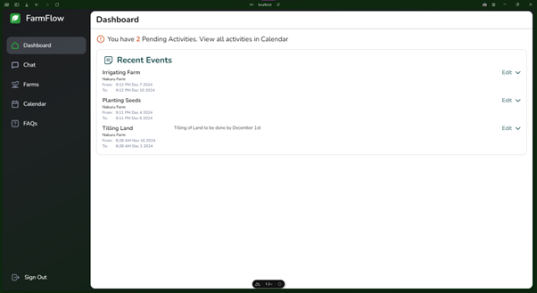
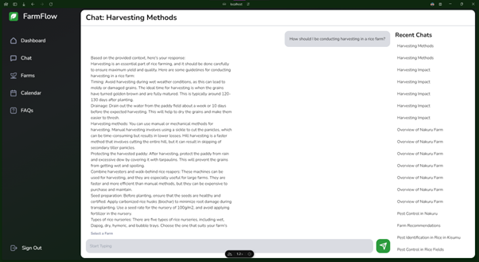
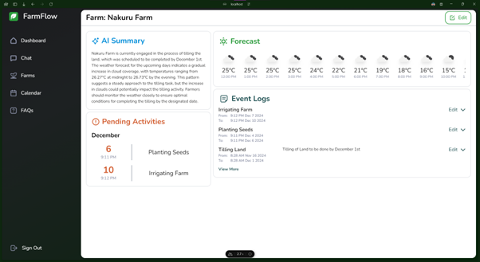
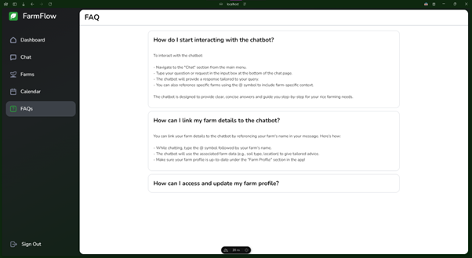

# FarmFlow

[](https://wakatime.com/badge/github/Arnie1x/farmflow)

FarmFlow is an AI-powered advisory platform designed to assist rice farmers in optimizing their agricultural practices. By combining expert farming knowledge with real-time insights, FarmFlow provides personalized recommendations on crop health, resource use, and cost-saving strategies. The platform features a user-friendly chatbot and integrates advanced language models to deliver accurate and actionable advice tailored to individual farm needs.

This application aims to make sustainable farming practices more accessible, helping farmers improve yields and reduce costs while addressing the challenges of modern agriculture.

## Table of Contents

- [Features](#features)
- [Installation](#installation)
- [Database](#database)
- [Usage](#usage)
- [Screenshots](#screenshots)

## Features

- **AI-Driven Chatbot**: Provides expert advice on crop health, soil management, pest control, and more through a natural and intuitive conversational interface.
- **Real-Time Weather Insights**: Integrates with OpenWeatherAPI to deliver timely weather data and recommendations based on farm-specific conditions.
- **Farm Activity Tracking**: Allows users to log farm events, offering insights into the relationship between activities and environmental conditions.
- **Responsive Web Interface**: Developed with Nuxt.js for seamless user interaction across various devices.
- **Customizable Backend**: Built with FastAPI and LangChain for efficient document processing, embedding generation, and AI integration. Uses HuggingFace Inference API for advanced language models such as the one used in this repository, `Qwen/Qwen2.5-Coder-32B-Instruct`.
- **Modular Codebase**: Easy to set up and extend, ensuring flexibility for future development.
- **Secure Database Management**: Utilizes Supabase with Row Level Security (RLS) for enhanced data security and role-based access control.

## Installation

Follow these steps to set up the project on your local machine:

### Prerequisites
- **Node.js** (v16+)
- **pnpm** package manager
- **Python** (v3.10+)
- A virtual environment tool (e.g., `venv`)
- `.env` file with required API keys and configuration details (copy template from `.env.example` and fill in the API Keys)

### Setting up the Nuxt.js App

1. Clone the repository:
   ```bash
   git clone https://github.com/Arnie1x/farmflow.git
   cd farmflow
   ```

2. Install dependencies using pnpm:
   ```bash
   pnpm install
   ```

3. Start the development server:
   ```bash
   pnpm run dev
   ```

4. Access the app at `http://localhost:3000`.

### Setting up the Python Server

1. Navigate to the Python server directory:
   ```bash
   cd python
   ```

2. Create a virtual environment:
   ```bash
   python -m venv venv
   source venv/bin/activate    # On Windows: venv\Scripts\activate
   ```

3. Install the required Python packages:
   ```bash
   pip install -r requirements.txt
   ```

4. Run the FastAPI server:
   ```bash
   python main.py
   # or
   uvicorn main:app --reload
   ```

5. The server will be available at `http://localhost:8000`.

## Database

FarmFlow uses **Supabase** as its database solution, offering a secure and scalable backend for managing user and farm data. 

### Key Features:
- **Schema Design**: The database schema is stored in the `/assets` directory of this repository. It includes tables for user profiles, farm activities, weather logs, and AI interactions.
- **Row Level Security (RLS)**: Supabase's RLS ensures fine-grained access control, allowing only authorized users to view and modify specific data based on their roles.
- **Real-Time Updates**: Leveraging Supabase's real-time capabilities, the database synchronizes user actions with the Nuxt.js frontend, ensuring a seamless user experience.

To set up the database, follow these steps:
1. Navigate to the Supabase dashboard and create a new project.
2. Import the schema located in `/assets/schema.sql` into the project by copy and pasting the SQL into the SQL editor and running it as a query.
3. Configure RLS policies to secure your tables (examples provided in the schema file).

## Usage

1. Open the Nuxt.js app in your browser at `http://localhost:3000`.
2. Use the chatbot to ask questions, or receive weather-based recommendations based on the farm that has been referenced before sending a chat message.
3. The AI model will process user queries and provide tailored responses based on expert farming literature and real-time data.

## Screenshots

### Sign In


### Dashboard


### Chat Page


### Farm Page


### FAQ Page

```
